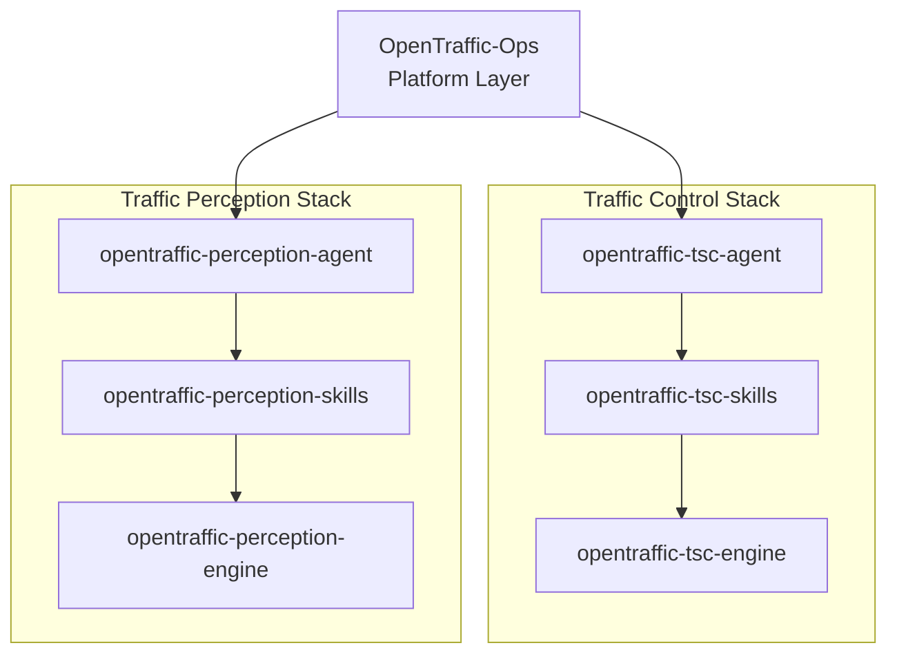

<div align="center">

# 🚦 OpenTraffic

### Intelligent Transportation Open Infrastructure Community

构建面向未来城市交通的 **感知 · 决策 · 控制 · 部署一体化基础设施**

</div>

<p align="center">
  
  
  
  
</p>

---

# 🌍 Overview

OpenTraffic 是一个面向智能交通系统的开源基础设施项目，致力于构建：

* 🚗 交通感知（Perception）
* 🚦 信号控制（Control）
* 🧠 强化学习与智能决策（RL / Agent）
* ⚙️ 边缘计算与系统部署（Ops）

整体采用**分层 Agent 架构 + 双体系（感知 / 控制）设计**。

---

# 🧱 Architecture

## 🧭 System Design



---

# ⚙️ Core Platform

## 🧩 OpenTraffic-Ops (Platform Layer)
👉 [GitHub Repository](https://github.com/OpenTraffic-Team/opentraffic-ops)
统一系统运行底座，负责全局调度与基础设施能力。


* Agent 生命周期管理（启动 / 停止 / 调度）
* 模型与服务注册中心
* 任务编排与运行时管理
* 数据流与消息系统
* 边缘-云协同执行

---

# 🚦 Traffic Control Stack

## 🤖 opentraffic-tsc-agent

👉 [GitHub Repository](https://github.com/OpenTraffic-Team/opentraffic-tsc-agent)

* 多路口协同控制
* Agent 决策编排
* 在线 / 离线推理
* 与 Ops 系统交互

---

## 🛠 opentraffic-tsc-skills

👉 [GitHub Repository](https://github.com/OpenTraffic-Team/opentraffic-tsc-skills)

* 相位切换策略
* 排队长度 / 流量计算
* reward / cost 设计
* 安全约束与动作规则

---

## 🧠 opentraffic-tsc-engine

👉 [GitHub Repository](https://github.com/OpenTraffic-Team/opentraffic-tsc-engine)

* 强化学习 / 规则 / 混合控制模型
* 状态与动作空间定义
* 信号控制策略训练与推理
* 多阶段控制算法

---

# 👁️ Traffic Perception Stack

## 🤖 opentraffic-perception-agent

👉 [GitHub Repository](https://github.com/OpenTraffic-Team/opentraffic-perception-agent)

* 多模型协同调度
* 场景级感知任务执行
* 结构化交通状态输出
* Ops 协同通信

---

## 🛠 opentraffic-perception-skills

👉 [GitHub Repository](https://github.com/OpenTraffic-Team/opentraffic-perception-skills)

* 目标跟踪与 ID 管理
* 轨迹重建
* 流量 / 速度统计
* 事件检测（拥堵 / 事故）

---

## 🧠 opentraffic-perception-engine

👉 [GitHub Repository](https://github.com/OpenTraffic-Team/opentraffic-perception-engine)

* 目标检测 / 跟踪 / 分类模型
* 多摄像头融合推理
* 边缘端轻量模型（TIR 等）
* 统一推理接口

---

# 🔁 Data Flow

## 🚦 Control Pipeline

```text
OpenTraffic-Ops
   ↓
opentraffic-tsc-agent
   ↓
opentraffic-tsc-skills
   ↓
opentraffic-tsc-engine
```

## 👁️ Perception Pipeline

```text
OpenTraffic-Ops
   ↓
opentraffic-perception-agent
   ↓
opentraffic-perception-skills
   ↓
opentraffic-perception-engine
```

---

# 🧠 Design Philosophy

* 分层解耦（Ops / Agent / Skills / Engine）
* 感知与控制对称架构设计
* 小模型优先（Edge-friendly Engine Layer）
* Agent 负责智能编排，不直接执行底层计算
* Ops 作为统一系统操作底座

---

# 🚀 Highlights

* 🧠 Agent-based traffic intelligence
* ⚡ Real-time edge deployment
* 🔄 RL-based signal optimization
* 👁️ Multi-camera perception fusion
* 🧩 Modular plugin architecture

---

# 📦 Repositories
### 💻  OPS
* [https://github.com/OpenTraffic-Team/opentraffic-tsc-ops](https://github.com/OpenTraffic-Team/opentraffic-ops)


### 🚦 Control

* [https://github.com/OpenTraffic-Team/opentraffic-tsc-agent](https://github.com/OpenTraffic-Team/opentraffic-tsc-agent)
* [https://github.com/OpenTraffic-Team/opentraffic-tsc-skills](https://github.com/OpenTraffic-Team/opentraffic-tsc-skills)
* [https://github.com/OpenTraffic-Team/opentraffic-tsc-engine](https://github.com/OpenTraffic-Team/opentraffic-tsc-engine)

### 👁️ Perception

* [https://github.com/OpenTraffic-Team/opentraffic-perception-agent](https://github.com/OpenTraffic-Team/opentraffic-perception-agent)
* [https://github.com/OpenTraffic-Team/opentraffic-perception-skills](https://github.com/OpenTraffic-Team/opentraffic-perception-skills)
* [https://github.com/OpenTraffic-Team/opentraffic-perception-engine](https://github.com/OpenTraffic-Team/opentraffic-perception-engine)

---

# 🌐 Community

OpenTraffic 欢迎以下方向的贡献者：

* 🚗 智能交通算法研究者
* 🧠 强化学习开发者
* 👁️ 计算机视觉工程师
* ⚙️ 边缘计算与系统工程师
* 🚦 智慧交通行业从业者

---

# 📬 Contact

For collaboration or contributions, please reach out to the OpenTraffic team.
