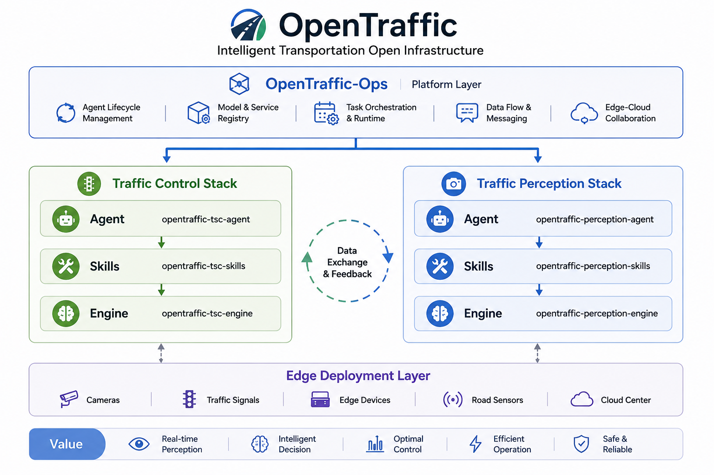

<div align="right">

[**中文**](README_CN.md) | **English**

</div>

<div align="center">

# 🚦 OpenTraffic

### Intelligent Transportation Open Infrastructure Community

Building an integrated **Perception · Decision · Control · Deployment infrastructure** for future urban mobility.

</div>
<div align="center">

[](LICENSE)
[](https://huggingface.co/OpenTraffic)
[](https://x.com/OpenTraffic_CN)
[](https://github.com/OpenTraffic-Team/OpenTraffic-TSC-Engine/blob/main/pic/wechat.jpg)

</div>

---

# 🌍 Overview

OpenTraffic is an open-source infrastructure project for intelligent transportation systems, focused on building:

* 🚗 Traffic Perception
* 🚦 Signal Control
* 🧠 Reinforcement Learning & Intelligent Decision-Making (RL / Agent)
* ⚙️ Edge Computing & System Deployment (Ops)

Built on a **layered Agent architecture with dual stacks (Perception / Control)**.

---

# 🧱 Architecture

## 🧭 System Design

<div align="center">
  
</div>

---

# ⚙️ Core Platform

## 🧩 OpenTraffic-Ops (Platform Layer)
👉 [GitHub Repository](https://github.com/OpenTraffic-Team/opentraffic-ops)
The unified system runtime foundation, responsible for global scheduling and infrastructure capabilities.

* Agent lifecycle management (start / stop / scheduling)
* Model and service registry
* Task orchestration and runtime management
* Data flow and messaging system
* Edge-cloud collaborative execution

---

# 🚦 Traffic Control Stack

## 🤖 opentraffic-tsc-agent

👉 [GitHub Repository](https://github.com/OpenTraffic-Team/opentraffic-tsc-agent)

* Multi-intersection coordinated control
* Agent decision orchestration
* Online / offline inference
* Interaction with Ops system

---

## 🛠 opentraffic-tsc-skills

👉 [GitHub Repository](https://github.com/OpenTraffic-Team/opentraffic-tsc-skills)

* Phase switching strategies
* Queue length / traffic flow calculation
* Reward / cost design
* Safety constraints and action rules

---

## 🧠 opentraffic-tsc-engine

👉 [GitHub Repository](https://github.com/OpenTraffic-Team/opentraffic-tsc-engine)

* RL / rule-based / hybrid control models
* State and action space definition
* Signal control policy training and inference
* Multi-stage control algorithms

---

# 👁️ Traffic Perception Stack

## 🤖 opentraffic-perception-agent

👉 [GitHub Repository](https://github.com/OpenTraffic-Team/opentraffic-perception-agent)

* Multi-model collaborative scheduling
* Scene-level perception task execution
* Structured traffic state output
* Ops communication

---

## 🛠 opentraffic-perception-skills

👉 [GitHub Repository](https://github.com/OpenTraffic-Team/opentraffic-perception-skills)

* Object tracking and ID management
* Trajectory reconstruction
* Traffic flow / speed statistics
* Event detection (congestion / accidents)

---

## 🧠 opentraffic-perception-engine

👉 [GitHub Repository](https://github.com/OpenTraffic-Team/opentraffic-perception-engine)

* Detection / tracking / classification models
* Multi-camera fusion inference
* Edge lightweight models (TIR, etc.)
* Unified inference interface

---

# 🔁 Data Flow

## 🚦 Control Pipeline

```text
OpenTraffic-Ops
   ↓
opentraffic-tsc-agent
   ↓
opentraffic-tsc-skills
   ↓
opentraffic-tsc-engine
```

## 👁️ Perception Pipeline

```text
OpenTraffic-Ops
   ↓
opentraffic-perception-agent
   ↓
opentraffic-perception-skills
   ↓
opentraffic-perception-engine
```

---

# 🧠 Design Philosophy

* Layered decoupling (Ops / Agent / Skills / Engine)
* Symmetric architecture for perception and control
* Small models first (Edge-friendly Engine Layer)
* Agents handle intelligent orchestration, not low-level computation
* Ops as the unified system operation foundation

---

# 🚀 Highlights

* 🧠 Agent-based traffic intelligence
* ⚡ Real-time edge deployment
* 🔄 RL-based signal optimization
* 👁️ Multi-camera perception fusion
* 🧩 Modular plugin architecture

---

# 📦 Repositories

### 💻 OPS
* [https://github.com/OpenTraffic-Team/opentraffic-ops](https://github.com/OpenTraffic-Team/opentraffic-ops)

### 🚦 Control
* [https://github.com/OpenTraffic-Team/opentraffic-tsc-agent](https://github.com/OpenTraffic-Team/opentraffic-tsc-agent)
* [https://github.com/OpenTraffic-Team/opentraffic-tsc-skills](https://github.com/OpenTraffic-Team/opentraffic-tsc-skills)
* [https://github.com/OpenTraffic-Team/opentraffic-tsc-engine](https://github.com/OpenTraffic-Team/opentraffic-tsc-engine)

### 👁️ Perception
* [https://github.com/OpenTraffic-Team/opentraffic-perception-agent](https://github.com/OpenTraffic-Team/opentraffic-perception-agent)
* [https://github.com/OpenTraffic-Team/opentraffic-perception-skills](https://github.com/OpenTraffic-Team/opentraffic-perception-skills)
* [https://github.com/OpenTraffic-Team/opentraffic-perception-engine](https://github.com/OpenTraffic-Team/opentraffic-perception-engine)

---

# 🌐 Community

OpenTraffic welcomes contributors in the following areas:

* 🚗 Intelligent transportation algorithm researchers
* 🧠 Reinforcement learning developers
* 👁️ Computer vision engineers
* ⚙️ Edge computing and system engineers
* 🚦 Smart transportation industry practitioners

---

# 📬 Contact

For collaboration or contributions, please reach out to the OpenTraffic team.
